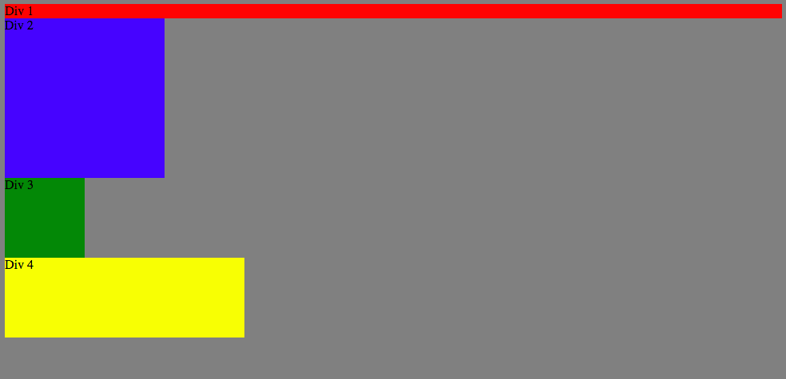

#3.4 Chrome Dev Tools

1. Change in Colors

2. Column

3. Row

4. Make Equidistant

5. Squares

6. Footer

7. Header

8. Sidebar

9. Get Creative

* **Reflection**

* **How can you use Chrome's DevTools inspector to help you format or position elements?**

Chrome DevTools allows you to update the HTML and CSS on the fly with real time updates, meaning you can see the results instantly once the change has been made. You can play around with the values to position the elements on the page to see how it would appear on the page.

* **How can you resize elements on the DOM using CSS?**

You can resize the elements on the DOM by setting the property of width and height. You select any of the elements whether they are tags, classes, or ids.

* **What are the differences between Absolute, Fixed, Static, and Relative Positioning? Which did you find easiest to use? Which was most difficult?**

Absolute positioning is positioning of elements referenced to the parent node that the node being styled is contained in. Absolute positioning also is not affected and does not affect other elements in the same node, meaning other elements will either appear over top of or in behind the other elements that are in the same container.

Fixed position is when elements are fixed to the viewport of the browser. When a user scrolls down the page the element remains in the view constantly. Again the elements that are fixed are not affected by the other elements on the page.

Static position is the default position used by the browsers. Elements that are set to static flow in accordance to its position in the structure of the HTML tree.

Relative positioning is the position of an element relative to where it would have been in the normal flow of elements.

* **What are the differences between Margin, Border, and Padding?**

The margin is the space between the outside of the element the margin is being applied to and the element that it is contained within. The border is the outer edge of the element, inside of the margin. The padding is the space between the border and the content contained within the element.

* **What was your impression of this challenge overall? (love, hate, and why?)**

My impression of this challenge was that it was pretty easy but good to know. Being able to make quick changes on the fly and seeing the results is much quicker than editing a file in the text editor, committing the changes, pushing them, going to the browser and refreshing the view. You are able to iterate over your ideas much quicker.