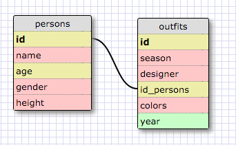

##RELEASE 5: SELECTing data from a database

1. Select all data for all states:
  SELECT * FROM states;

2. Select all data for all regions:
  SELECT * FROM regions;

3. Select `state_name` and population for all states:
  SELECT `state_name`, population FROM states;

4. Select `state_name` and population for all states ordered by population from highest to lowest:
    SELECT `state_name`, population FROM states ORDER BY population DESC;

5. Select the `state_name` for the states in region 7:
  SELECT `state_name` FROM states WHERE region_id=7;

6. Select `state_name` and population_density for states with a population density over 50 from least to most dense:
  SELECT `state_name`, population_density FROM states WHERE population_density>50 ORDER BY population_density ASC;

7. Select `state_name` for states with a population between 1 million and 1.5 million people:
  SELECT `state_name` FROM states WHERE population BETWEEN 1000000 AND 1500000;

8. Select the `state_name` and region_id for states ordered by region in descending order:
  SELECT `state_name`, region_id FROM states ORDER BY region_id ASC;

9. Select the `region_name` for the regions with "Central" in the name:
  SELECT `region_name` FROM regions WHERE `region_name` LIKE '%Central

10. Select the `region_name` and the `state_name` for all states and regions in ascending order by region_id:
  SELECT regions.`region_name`, states.`state_name` FROM regions INNER JOIN states ON regions.id=states.region_id ORDER BY states.region_id ASC;

##RELEASE 6: Your Own Schema

##RELEASE 7: Reflect

**- What are databases for?**
Databases are used as a mechanism to store, retrieve, edit, and remove data.

**- What is a one-to-many relationship?**
A one-to-many relationship is a relationship between tables in a database where one record in a table can reference several records in another table.

**- What is a primary key? What is a foreign key? How can you determine which is which?**
A primary key is an unique identifier in a table for a given set of records. No primary key can be the same for any record.

**- How can you select information out of a SQL database? What are some general guidelines for that?**
You can select information from a SQL database by querying the database for whatever is you are looking for..