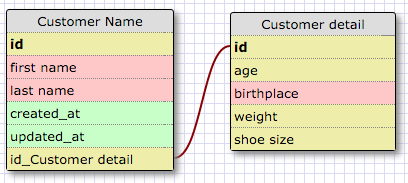

##RELEASE 2: Create a One-to-one Schema

##RELEASE 4: Refactor

##RELEASE 6: Reflect

**-What is a one-to-one database?**

It is a relational database that has two tables and that for each item in the one table, there is only one record that corresponds in the other table.

**-When would you use a one-to-one database? (Think generally, not in terms of the example you created).**

A one-to-one database would be used to break tables down in to smaller parts. A table could have more than a hundred columns if one wanted but it can be easier to break it down into smaller, more manageable pieces.

**-What is a many-to-many database?**

It is a relational database where the records in one table of the database could apply to multiple records of another table in a database and vice versa.

**-When would you use a many-to-many database? (Think generally, not in terms of the example you created).**

A many-to-many database occurs very frequently: when multiple items of one table are shared with multiple items of a second table and multiple items of the second table are shared with multiple items of the first table.

**-What is confusing about database schemas? What makes sense?**

The relationship concept helps to make it more understandable. The confusing part of a schemas is the one-to-one relationship but when you think of it as two parts of one whole, it makes more sense.